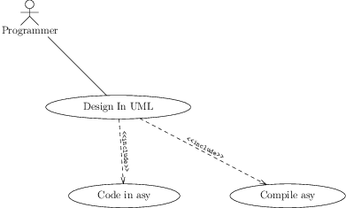
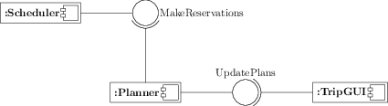
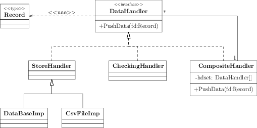
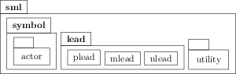

Asymptote Graph Theory
======================

Introduction
============

node.asy is not only easy to use, but also with great extensibility. can draw graph theory, automata, flowchart, circuit-like graphics

What's New (4.0)
================

Draw graph theory graph using adj matrix syntax

[view source](samples/graphmatrep.asy)

Gallery
=======

Automata:
---------

[view source](samples/automata.asy)

Boxes:
------

[view source](samples/boxes.asy)

Flow Chart:
-----------

[view source](samples/flowchart.asy)

Graph Illustration:
-------------------

[view source](samples/graphillustra.asy)

Graph Theory:
--------------

[view source](samples/graphmatrep.asy)

[view source](samples/graphtheory.asy)

SML:
----

### Hello SML

[view source](samples/hellosml.asy)

### Component

[view source](samples/component.asy)

### SML Class

[view source](samples/smlclass.asy)

### SML Lead

[view source](samples/smllead.asy)

Circuit:
--------

[view source](samples/circuit.asy)

Links
=====

Github:
-------

<https://github.com/taoari/asy-graphtheory>

### Obsoleted:

Google Code:

<http://code.google.com/p/asy-graphtheory>

CTEX:

<http://bbs.ctex.org/viewthread.php?tid=70055&extra=page%3D1>

<http://bbs.ctex.org/viewthread.php?tid=69922&extra=page%3D1>

SourceForge.net:

<https://sourceforge.net/projects/asymptote/forums/forum/409349/topic/4923334/index/page/1>

