Asymptote Graph Theory
======================

Introduction
============

node.asy is not only easy to use, but also with great extensibility. can draw graph theory, automata, flowchart, circuit-like graphics

What's New (5.0)
================

**Note**: v5.0 is **not** compatible with v4.0, with the new **layout** syntax replacing the old dock syntax

Scientific Publication:

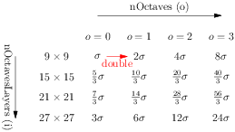
[view source](samples/surf-scalespace.asy)

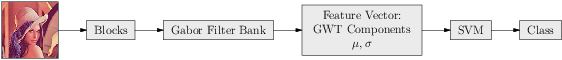
[view source](samples/gabor.asy)

Gallery
=======

The usage of this library is described [here](Usage.md), or you can just view the source codes of samples to figure out what they mean, they are quite self-explanatory!

Automata:
---------

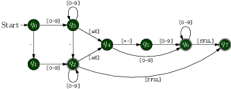
[view source](samples/automata.asy)

Flow Chart:
-----------

[view source](samples/flowchart.asy)

Graph Illustration:
-------------------

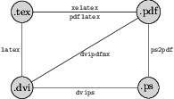
[view source](samples/graphillustra.asy)

Graph Theory:
--------------

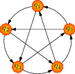
[view source](samples/graphtheory.asy)

### Graph Matrix Representation

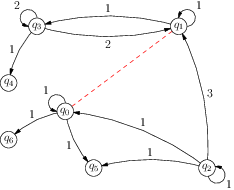
[view source](samples/graphmatrep.asy)

Boxes:
------

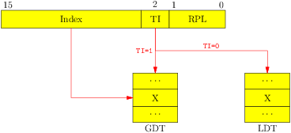
[view source](samples/boxes.asy)

### Fancy Box

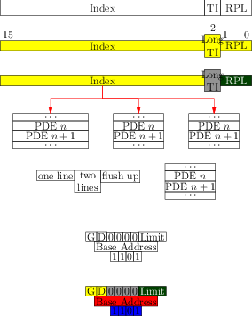
[view source](samples/boxes2.asy)

Scientific Publication:
----------------------

### Text Grid Layout

[view source](samples/surf-scalespace.asy)

### Image Node

[view source](samples/gabor.asy)

SML:
----

### SML Hello

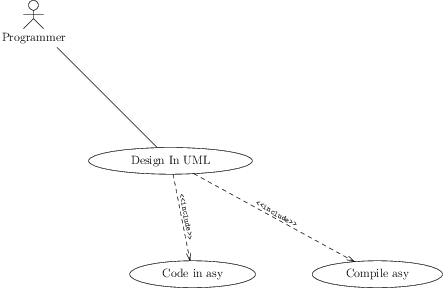
[view source](samples/sml_hello.asy)

### SML Component

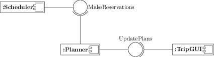
[view source](samples/sml_component.asy)

### SML Class

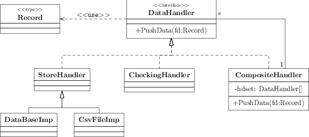
[view source](samples/sml_class.asy)

### SML Lead

[view source](samples/sml_lead.asy)

Circuit:
--------

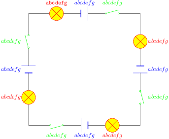
[view source](samples/circuit.asy)

What's New 
==========

4.0
---

Draw graph theory graph using adj matrix syntax

[view source](samples/graphmatrep.asy)

Links
=====

Github:
-------

<https://github.com/taoari/asy-graphtheory>

### Obsoleted:

Google Code:

<http://code.google.com/p/asy-graphtheory>

CTEX:

<http://bbs.ctex.org/viewthread.php?tid=70055&extra=page%3D1>

<http://bbs.ctex.org/viewthread.php?tid=69922&extra=page%3D1>

SourceForge.net:

<https://sourceforge.net/projects/asymptote/forums/forum/409349/topic/4923334/index/page/1>

